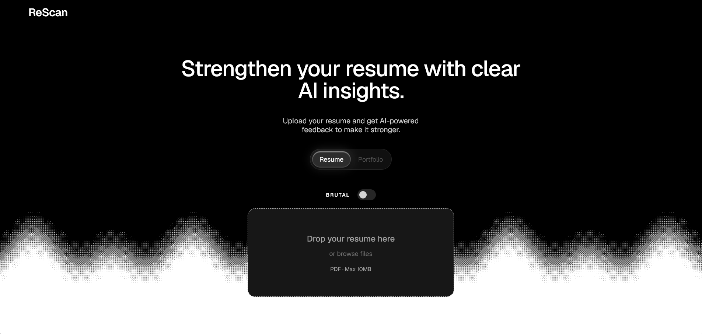

# ReScan — AI Resume & Portfolio Analyzer

An AI-powered tool that analyzes resumes and developer portfolios, identifies weaknesses, and provides actionable feedback to help improve your professional presence.

## Preview


**[Live Demo](https://rescan-ai.vercel.app)**

## Features

- AI-powered resume analysis
- Developer portfolio analysis
- Brutal Mode for more direct feedback
- Actionable improvement suggestions
- Responsive interface and smooth animations

## Tech Stack

- Next.js
- React
- TypeScript
- Tailwind CSS
- Motion for React
- Google Gemini API

## Getting Started

### Prerequisites

- Node.js
- npm
- Google Gemini API key

### Installation

```bash
git clone https://github.com/YOUR_USERNAME/YOUR_REPOSITORY.git
cd YOUR_REPOSITORY
npm install
```

Create a `.env.local` file in the root directory:

```env
GEMINI_API_KEY=your_gemini_api_key
```

Run the development server:

```bash
npm run dev
```

Open http://localhost:3000 in your browser.

## Environment Variables

| Variable | Description |
|---|---|
| `GEMINI_API_KEY` | API key for AI analysis |

**Security:** Never commit your actual API key.

## Deployment

Deployed with Vercel. Configure the required environment variables in your Vercel project settings.

## License

No license has been specified yet.
